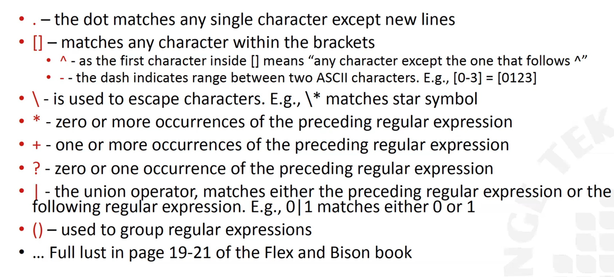
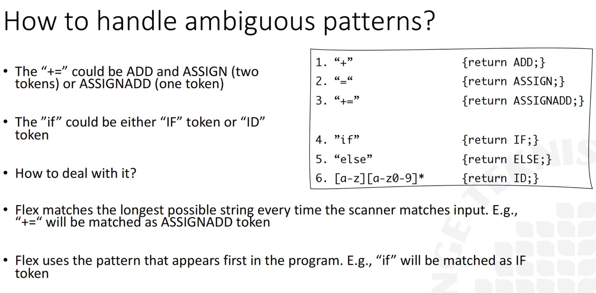

# Föreläsning 2
## Intro
The Lexical analysis also known as the scanner and is responsible for atomic language constructs(numbers, identifiers, reserved keywords). The lexer outputs a tokestream and the tokenanalyzer takes the stream and checks if it is correct based on some specific language grammar. The parser outputs a parsertree  
  
The semantic analysis which checks the correctness of the program with respect of the semantic of the program. The main role is to do typechecking(is a typechecker).

The symboltable stores information about the program. Such information might be variables, type and the scope of the variable.

## Lexical analysis overview
The first step in any compiler is the scanning phase(lexing analysis). It analyses raw source code and the main objective of the group the characters in a series of meaningful chuncks(**tokens**). The main role of the lexer is to scan and group toghether so that we can represent something. Each of theses groups are called **leximes**. Besides grouping and identifieng tokens it also has the role of discarding unessisacy constructs(e.g whitespaces). A token is an object that defines the comprises the name of the token and the value of the lexime. A lexime is a seqence of characters. An **identifier** is a sequence of characters that begins with a letter.

## Formal languages
**A formal language has:**  
- Symbols: The smallest identifiable units(characters, digits)
- Alphabet: $\sum$ - a set of symbols
- Strings: a fnite a sequence of symbols from $\sum$
  - The emtpty string $\epsilon$ is a special string
  - |s| - lenght of the string

**Definition: A language L is a possibly infinite set of strings over a finite alphabet  $\sum$, denoted as L($\sum$)**
- E.g {xy, xyxy, xyxyxy, ...} is a language over $\sum = (x,y)$
- E.g any binary number is a string over the alphabet $\sum = {0, 1}$ with symbols 0 and 1
- E.g ASCII is an important example of an alphabet


## Formal language examples
**Let l = {A, B, ..., Z, a, b, ...., z} and D = {0, 1, ..., 9}

1. $L U D$ - the set of letters and digits
2. $LD$ - the set of strings of lenght 2, consisting of one letter followed by one digit
3. $L^4$ is the set of all 4-letter strings
4. $L^*$ is the set of all strings of letters, including the empty string
5. $L(L U D)^*$ is the set of all strings of letters and digits beginning wit ha letter
6. $d^+$ is the set of all strings of one or more digits

## Regular language and regular experssions
**Regular expressions:**  
Union: $A U B = a | b$ read as a or b  
Concatienation: $a * b = ab$ read as a followed by b  
Kleene closure: $a*$ read as zero or more a's

**Shortcuts**  
Positive closure: $a+ = aa*$ read as one or more occurences of a  
Optionally: $a? = \epsilon / a$ read as zero or mroe occurences of a  
range: $[0-9] = 0|1|2|3|4|5|6|7|8|9,  
[a-cA-C] = a|b|c|A|B|C$

**Precedence**  
E.g, $ab*|b*a = (a(b*))$  |  $((b*)a)$


**A finite automata is basically the scanner or the set of rules in the flex file**


#### Regular experssions to DFA: Concatenation
'append' the two expressions together.

#### Regular experssions to DFA: Union
Add multiple transitions for each choice

#### Regular experssions to DFA: Closure
Kleene closure represents a loop in the DFA, $\epsilon$ is accepted state and when concatenation, closure can be skipepd. Is marked with *


## Handeling troublesome DFAs
If we have $x*x$ this would lead to an illegal DFA, why?: Because there are non-unique labels from state 0into state 1. Solution would be: $x*x = xx*$

**A valid DFA needs to have unique edges! This is due to we need to know which edge to pick. -> non deterministic finite automata**

## Nondeterministic finite automata(NFA)
Non-determinism: multiple choices, one of which is right  
Determinsim: One right choice only

### Powerset construction algorithm(NFA -> DFA)
Algorithm outline:
- DFA state 0 = all $\epsilon$ equivalent states of NFA 0
- Which states can  be reached from DFA 0 on input x, y, z, ...?
  - => new DFA states 1, 2, 3, ...
- Repeat (2) with DFA states 1, 2, 3, ... untill there are no new DFA states.


## Implementation of DFAs:
- DFA as control flow: switch cases, if else
- Data driven - The DFA is stored in data structures and a function reads the data structure and performs the necessary transitions
- OOP based- The regular expressions and the operators are classes and objects


## Flex special characters




# Föreläsning 3 - Syntax analyis
## The role of a syntax analysis - parsing
- Input_ program representation(token sequence) generated by the lexer
- Output: parse(syntax) tree
- A parse tree comprises nodes and non-labeled edges
- The output of the parser will be used by the rest of the compiler

## Types of parsers
### Top down parsers
- Starts with a symbol and builds the tree in a top-down way
- Can handle a restricted set of grammars


### Bottom up parsers
- Recognizes subsequences of tokens and build the tree bottom up
- Can handle a restricted set of grammars

### Universal parsers
- Can parse any context free grammar
- To slow to beof any particular use

## Context free grammars
A language must:
- Include all correct programs
- Exlude all incorrect programs

Context free grammars are always used to define programming languages. A context free grammar comprises:
- Terminals ( (,), class, public, static, ... )
- Nonterminals (MainClass, ClassDeclaration, Identifier, ...)
- Productions(Goal, Mainclass, ClassDeclaration, ...)
  - **Nonterminal head (left side); ::= or ->; **Body**(right side)
- Start Symbol(Goal )

#### A context free grammar is a quadruple G = (T, N, P, S) where:
- T - is the set of terminals(tokens)
- N - is the set of non terminals(syntatic constructions)
- P:N -> (N U T)* - is the set of productions (non terminal definitions)
- S € N - is the start symbol

## Rewrites, production and reduction rules
```c
X -> YZ
Y -> "Hello" | "Goodbye"
Z -> "You
```
### Rewrite:
- We can replace X with YZ
- We can replace YZ with X

Production rules:
- Working f rom start symbol towards language strings. E.g X -> YZ
- Characteristic of top down parsers

Reduction rules
- Start with the string and fold up the string towards the start symbol. E.g, YZ -> X
- Characteristic of bottom up parsers

## Backus naur form
A meta language(language made for defining other languages)  
Bison is a syntax variation of BNF where BNF is a repeated productions with the same left hand side (A->$\alpha$, A_>$\beta$) can be written using BNF as $\alpha$|$\beta$

Terminals are the basic building blocks of the language. They represent the individual characters, such as keywords, operators, and punctuation, that make up the source code. Examples of terminals in the C programming language include "int", "+", and ";".

Non-terminals, on the other hand, are used to group terminals together into larger, more complex structures. These structures are often called productions, and they represent the different parts of the source code, such as statements, expressions, and declarations. Examples of non-terminals in the C programming language include "statement", "expression", and "declaration". 


41.38